# くろーどちゃん セットアップガイド
### ～ お子様と一緒に AI プログラミングを楽しむための準備手順 ～

---

## はじめに（全体の概要）

このガイドでは、AI（くろーどちゃん）とお子様が一緒にプログラミングを楽しむための環境を整えます。  
作業は **1〜2時間程度** を見込んでください。英語の画面が多く出てきますが、きちんと翻訳して読めば難しいことは書いていません。**手順通りに進めれば必ずできます。**

> 💡 **途中で確認ダイアログが出た場合は、あわてずに「はい」「Yes」「承諾する」「同意する」「Allow」などを選択してください。**

### セットアップの全体の流れ

| # | 内容 | 概要 |
|---|------|------|
| 1 | [GitHub アカウント作成・Copilot Pro 登録](#1-github-アカウントの作成と-copilot-pro-の登録) | AI を使うためのメインアカウント |
| 2 | [Git のインストール](#2-git-のインストール) | ファイル管理ツール（必須） |
| 3 | [VS Code インストール・リポジトリのクローン](#3-vs-code-のインストールとリポジトリのクローン) | プログラミング用エディタの準備 |
| 4 | [GitHub Copilot と VS Code の連携](#4-github-copilot-と-vs-code-の連携) | AI チャット機能の有効化 |
| 5 | [Terminal の使い方](#5-terminal-の使い方) | コマンド入力画面を開く方法 |
| 6 | [uv のインストール](#6-uv-のインストール) | Python 管理ツール |
| 7 | [nvm / Node.js / npx のインストール](#7-nvm--nodejs--npx-のインストール) | JavaScript 実行環境 |
| 8 | [Brave Search API の登録](#8-brave-search-api-の登録) | AI が画像検索できるようにする |
| 9 | [VOICEVOX のインストール](#9-voicevox-のインストール) | AI が声でしゃべれるようにする |
| 10 | [MCP の設定](#10-mcp-の設定) | AI とツールを繋ぐ設定ファイル |
| 11 | [Claude のテスト](#11-claude-のテスト) | 動作確認 |
| 12 | [設定ファイルのダウンロード](#12-設定ファイルのダウンロード) | くろーどちゃんの設定を取得 |
| 13 | [音声入力のセットアップ](#13-音声入力のセットアップ) | 声で話しかけられるようにする |

---

## 1. GitHub アカウントの作成と Copilot Pro の登録

### GitHub とは？

**GitHub（ギットハブ）** は、プログラムのコードを保存・管理するためのサービスです。世界中のエンジニアが使っており、今回はここに作業ファイルを保存します。また、AI アシスタント「GitHub Copilot」を使うためにもアカウントが必要です。

---

### 1-1. アカウント作成

👉 https://github.com/signup をブラウザで開きます。

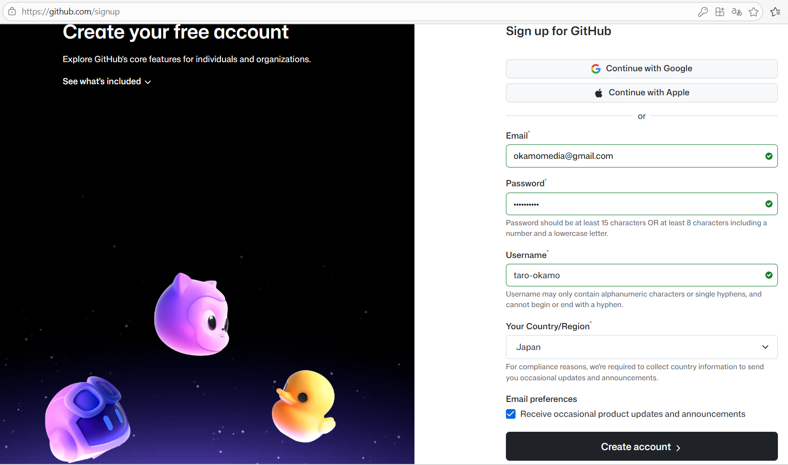

メールアドレス・パスワード・ユーザー名を **英数字で入力** し、**「Create account」** ボタンを押します。

> 💡 ユーザー名は後から変更しにくいため、シンプルなものがおすすめです（例：`yamada-taro`）。

---

### 1-2. メール認証

登録したメールアドレスに認証コードが届きます。コードをコピーして、画面に貼り付けてください。

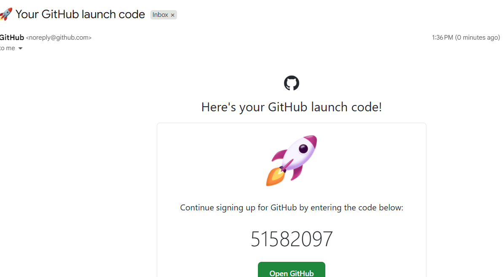

---

### 1-3. ログイン

👉 https://github.com/login からログインします。

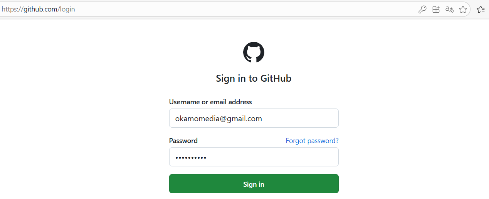

---

### 1-4. リポジトリの作成

ログイン後のダッシュボード画面から **「Create Repository」** を押します。

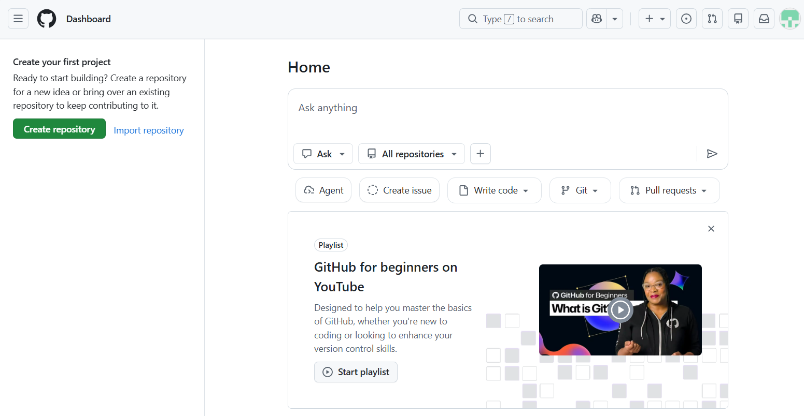

> 💡 **Repository（リポジトリ）** とは、ファイルを保存しておく「フォルダ」のようなものです。

---

### 1-5. リポジトリ名の入力

リポジトリ名（例：`LearningWithAI`）を入力し、**「Create Repository」** を押します。

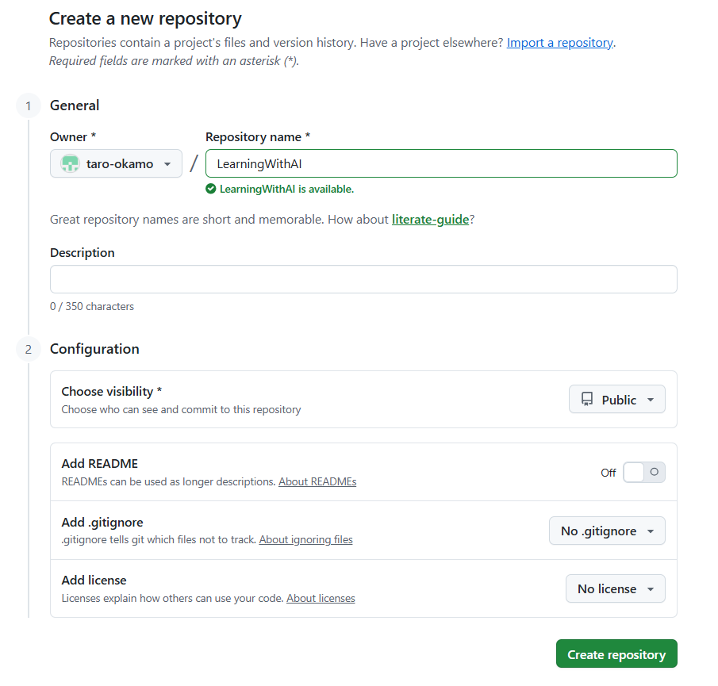

> 💡 **公開範囲について：** 作成物を他の人に見られたくない場合は、`Public`（公開）ではなく **`Private`（非公開）** を選択してください。

---

### 1-6. リポジトリの URL をコピー

コピーボタンでリポジトリの URL（例：`https://github.com/xxxx/LearningWithAI.git`）をコピーし、**メモ帳などに保存**しておきます（後で使います）。

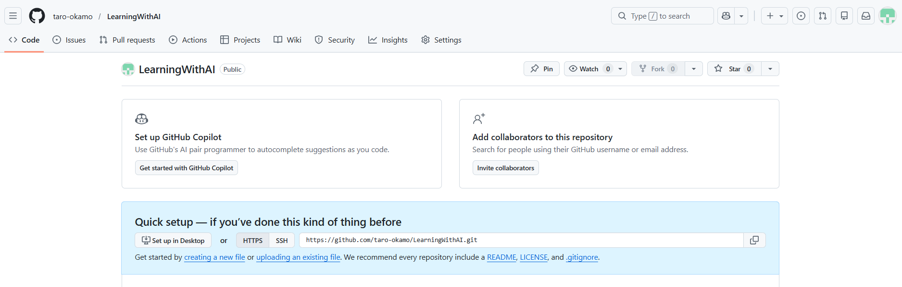

---

### 1-7. Copilot の設定メニューを開く

右上のロボットのようなアイコンをクリックし、**「Settings」** を選択します。

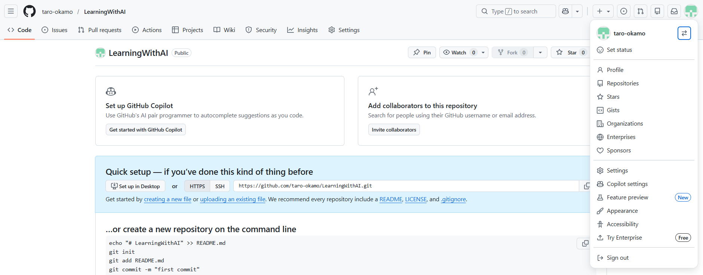

---

### 1-8. Copilot の Features 画面を開く

左メニューの **Copilot → Features** を選択します。

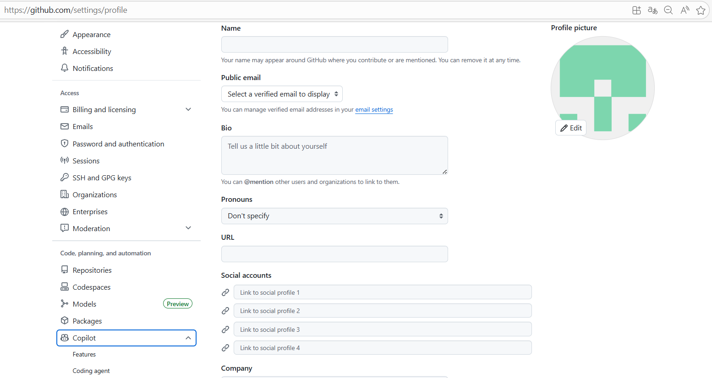

---

### 1-9. Copilot Pro の登録

**「Try Copilot Pro」** を選択します（月額 10 ドルのプランです）。

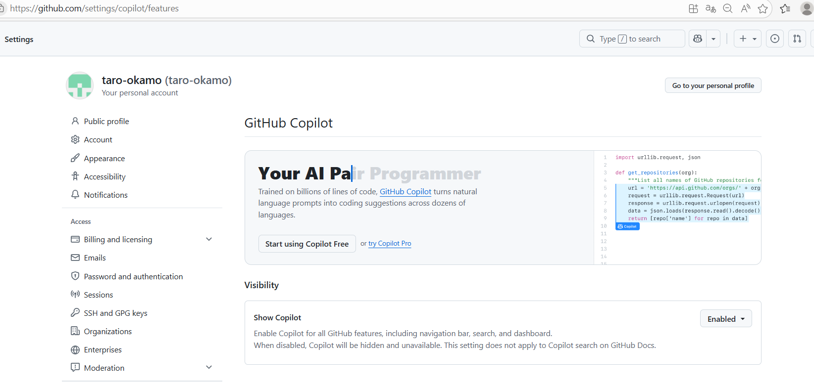

30 日間は無料です。**「Try now」** を選択します。

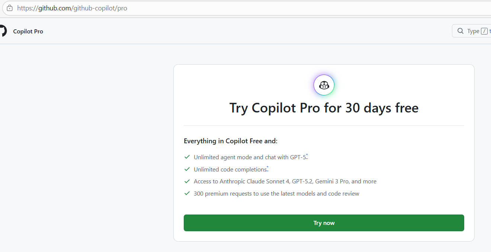

月払い（10 ドル）か年払い（100 ドル）のいずれかを選び、氏名・住所を **英語で** 入力します。

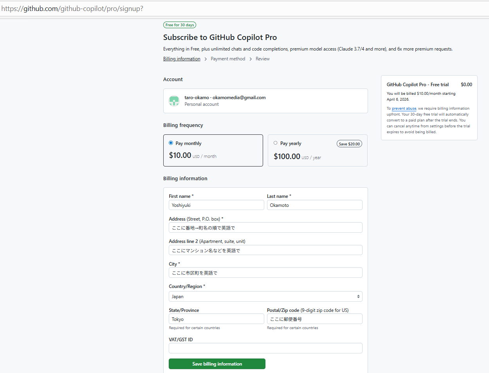

> 💡 **住所の英語入力例：**  
> Name: `Taro Yamada`  
> Address: `1-2-3 Shinjuku`  
> City: `Shinjuku-ku`  
> State/Province: `Tokyo`  
> Postal Code: `160-0022`  
> Country: `Japan`

支払い用のクレジットカード情報を入力します。

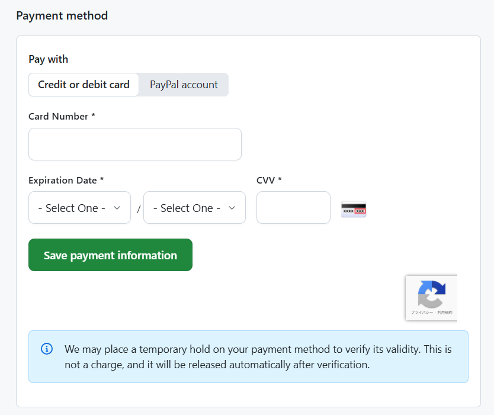

---

### 1-10. Copilot Pro を有効化

画面右側に **「Activate now」** ボタンが出ますので、クリックして有効化します。

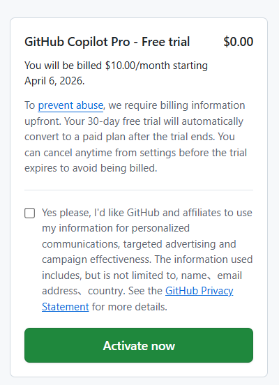

---

### 1-11. Copilot ホーム画面

Copilot のホーム画面が表示されます。**右上のダウンロードマークは VS Code のインストール後に使います**。この画面はそのままにして、別の新しいタブを開いてください。

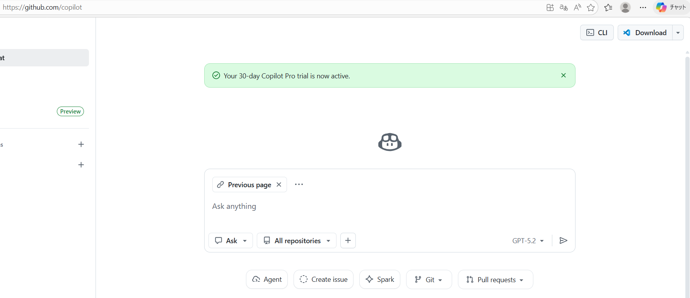

---

## 2. Git のインストール

### Git とは？

**Git（ギット）** は、ファイルの変更履歴を管理するツールです。VS Code で「リポジトリをクローン（コピー）する」機能を使うには、Git が PC にインストールされている必要があります。VS Code には Git の操作画面が内蔵されていますが、**Git 本体は別途インストールが必要**です。

---

### 2-1. Git をインストール

まず PowerShell を開きます。

**スタートメニュー検索（最速）：** `Windows キー` を押して「powershell」と入力し、検索結果の **「Windows PowerShell」** を選択します。

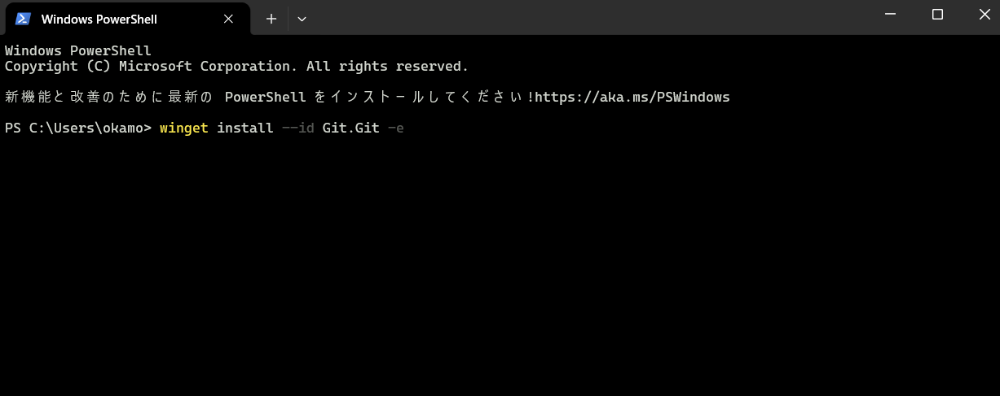

PowerShell が開いたら、以下のコマンドをコピー＆貼り付けして Enter キーを押します。

```
winget install --id Git.Git -e
```

> 💡 途中で確認ダイアログが出た場合は、あわてずに「Y」や「はい」を選択してください。

> ⚠️ **インストール完了後、PowerShell をいったん閉じてください。** 次に VS Code を開いたとき、Git が自動で認識されます。

---

## 3. VS Code のインストールとリポジトリのクローン

### VS Code とは？

**VS Code（ビジュアルスタジオコード）** は、Microsoft が無料で提供しているプログラミング用のテキストエディタです。AI との対話もここで行います。

---

### 3-1. VS Code をダウンロード

👉 https://code.visualstudio.com/download をブラウザで開きます。

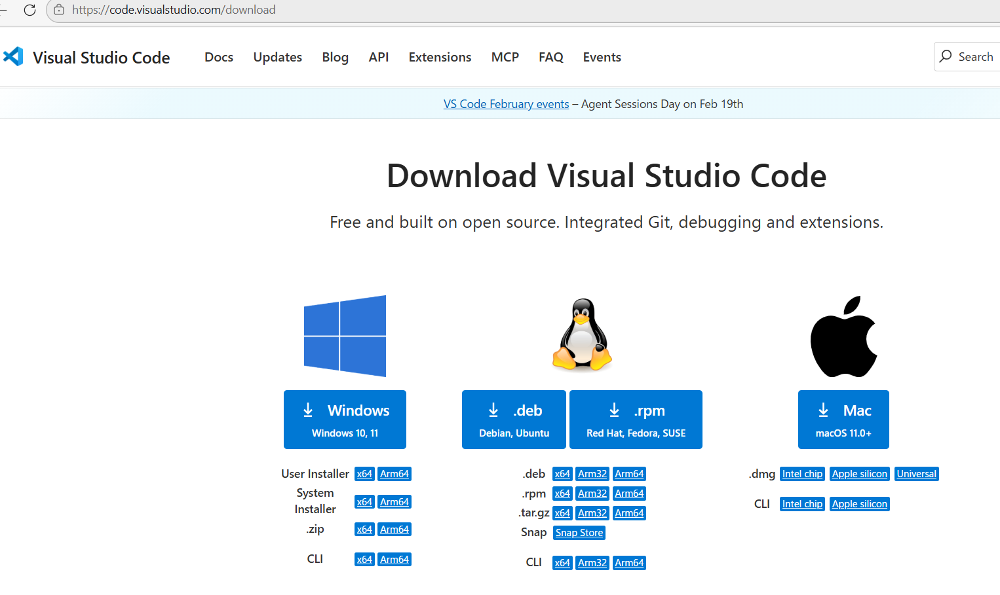

**「Windows」** をクリックしてダウンロードします。

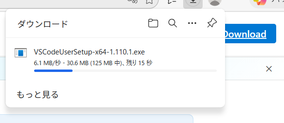

---

### 3-2. インストーラーを起動

ダウンロードしたインストーラーファイルをダブルクリックして起動します。

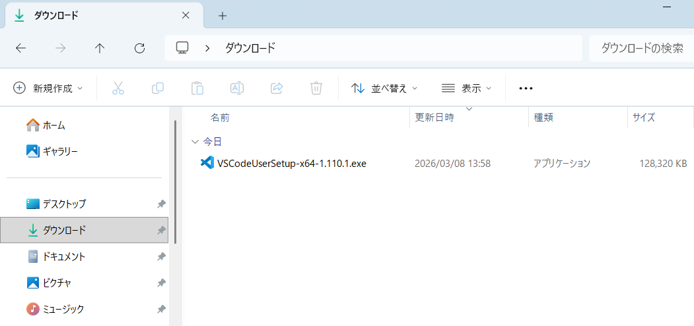

> 💡 途中で確認ダイアログが出た場合は、あわてずに「はい」「Yes」「承諾する」「同意する」「Allow」などを選択してください。

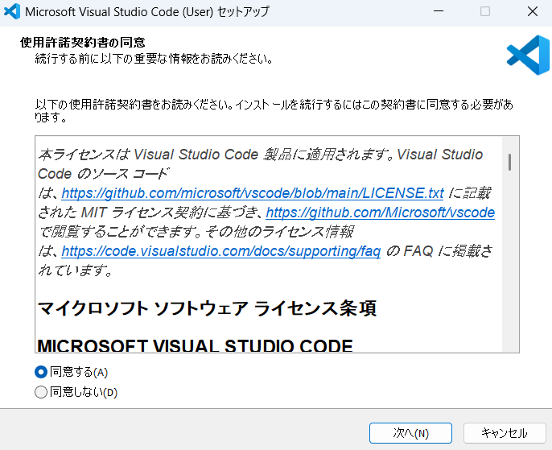

---

### 3-3. インストール完了

「実行する」にチェックをつけて **「完了」** ボタンを押します。

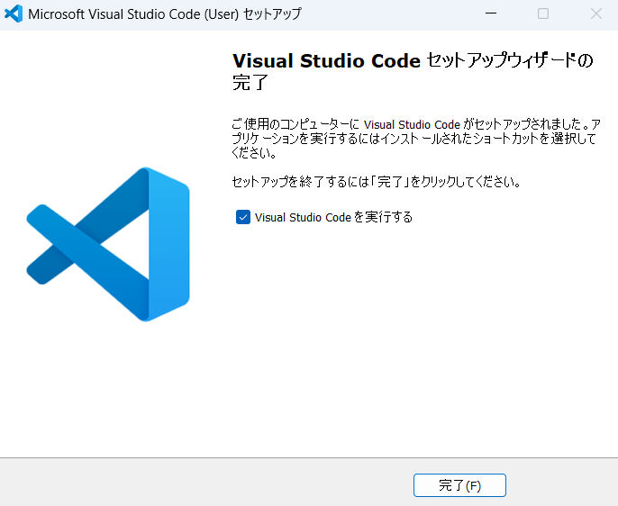

---

### 3-4. VS Code が起動

VS Code が開きました！

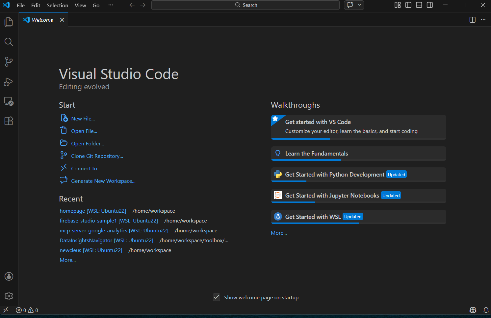

---

### 3-5. リポジトリをクローン

**`Ctrl` + `Shift` + `G`** の 3 つのキーを同時に押し、**「Clone Repository」** ボタンを押します。

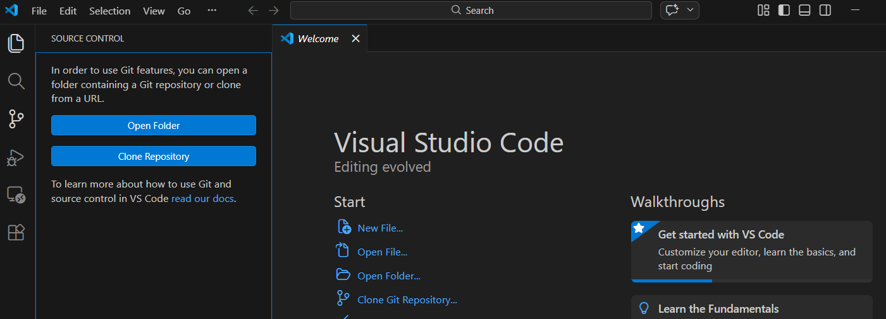

> 💡 **クローン（Clone）** とは、GitHub に保存したファイルを自分の PC にコピーすることです。

---

### 3-6. リポジトリ URL を貼り付け

先ほどメモしたリポジトリの URL（例：`https://github.com/xxxx/LearningWithAI.git`）を貼り付けて、**Enter キー**を押します。

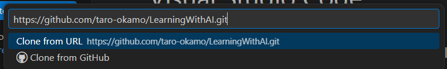

---

### 3-7. 保存先フォルダを選択

デスクトップに `LearningWithAI` フォルダを作成し、そのフォルダを選択します。

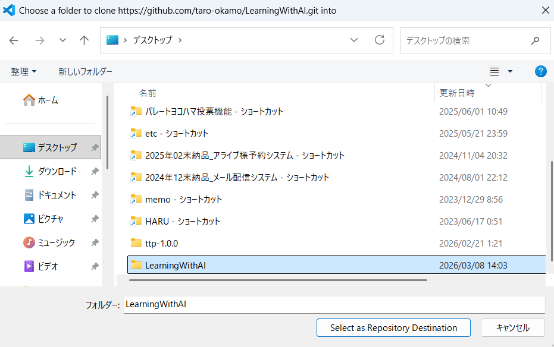

---

### 3-8. ワークスペースを開く

**「Open」** を選択します。

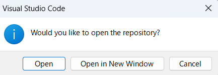

> 💡 途中で確認ダイアログが出た場合は、あわてずに同意チェックをつけて、「はい」「Yes」「承諾する」「同意する」「Allow」「trust」などを選択してください。

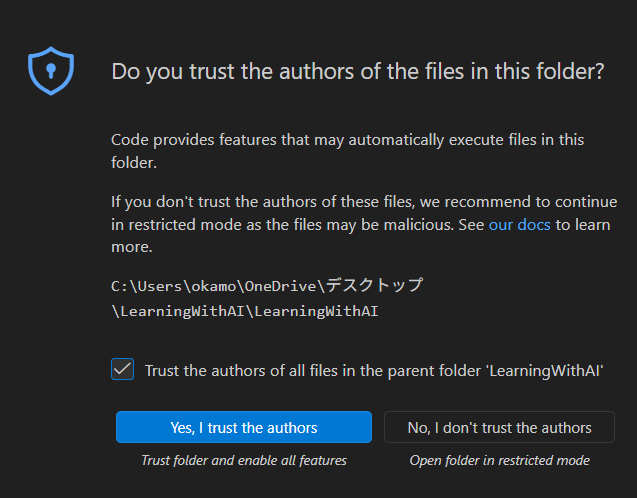

---

## 4. GitHub Copilot と VS Code の連携

### 4-1. Copilot ホーム画面に戻る


先ほど開いておいた Copilot のホーム画面github.com/copilotに戻り、**右上のダウンロードボタン**をクリックします。

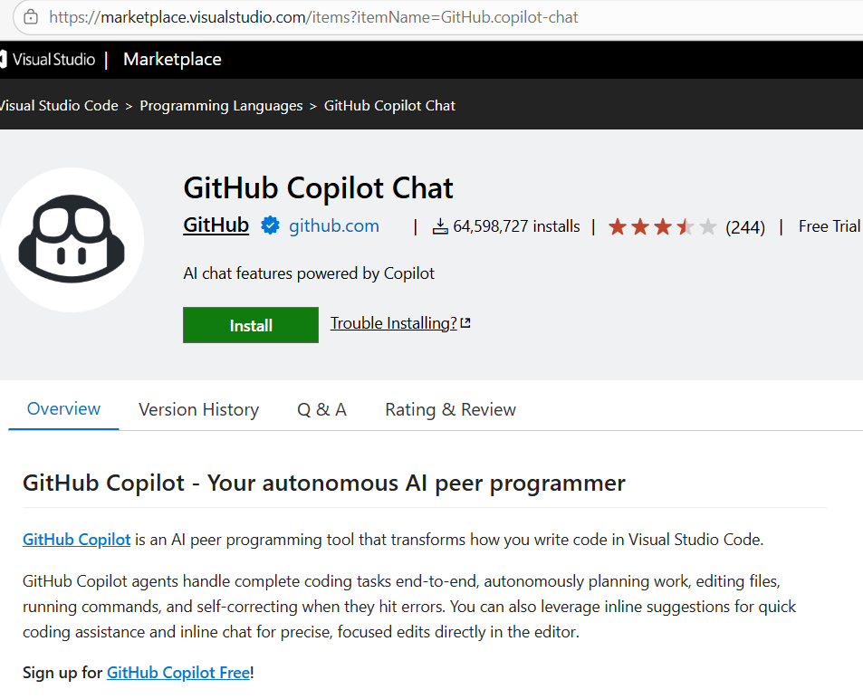

クリック後、**「Install」** ボタンを押します。

---

### 4-2. VS Code との連携を続ける

チェックを入れて **「Continue」** を押します。

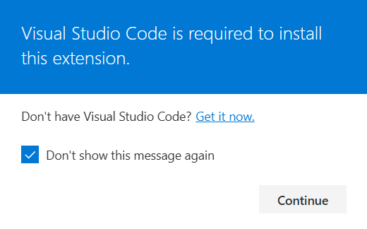

---

### 4-3. VS Code で開く

チェックを入れて **「開く」** を押します。

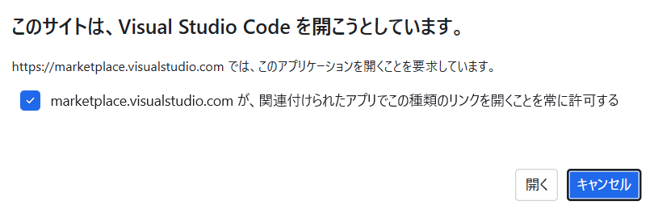

---

### 4-4. 連携完了

右下にチャット入力欄が表示されれば成功です！

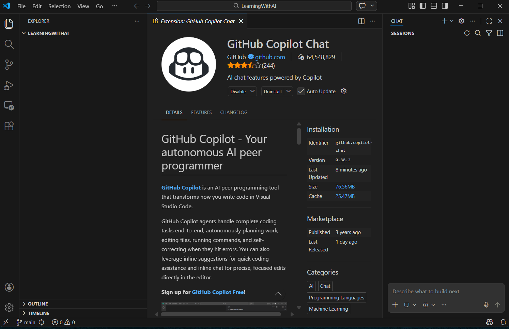

---

## 5. Terminal の使い方

### Terminal とは？

**Terminal（ターミナル）** は、PC にコマンド（命令文）を直接入力して操作するための画面です。今後の手順でよく使います。

---

### 5-1. Terminal を開く

**`Ctrl` + `Shift` + `@`** の 3 つのキーを同時に押して Terminal を開きます。

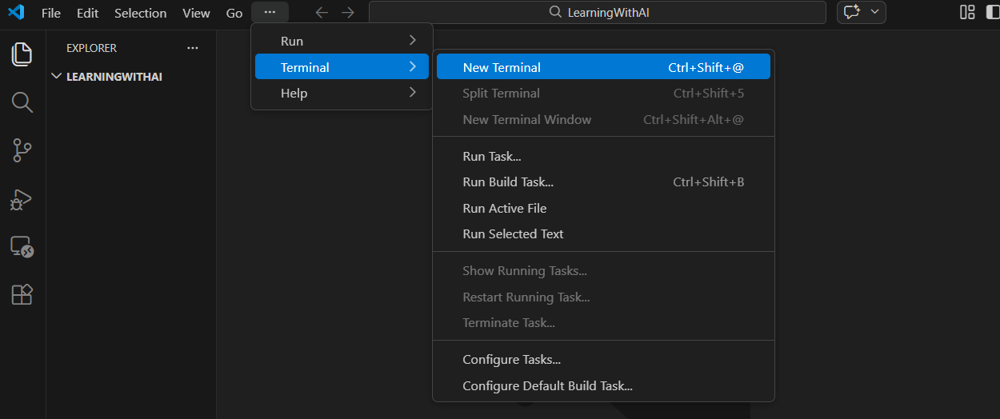

> 💡 VS Code の下部に黒い画面が開けば成功です。ここにコマンドを入力します。

---

## 6. uv のインストール

### uv とは？

**uv** は Python（プログラミング言語）の環境を管理するためのツールです。AI がプログラムを動かすために必要です。

---

### 6-1. uv をインストール

Terminal に以下のコマンドを **コピー＆貼り付け**して、Enter キーを押します。

```
winget install --id=astral-sh.uv -e
```

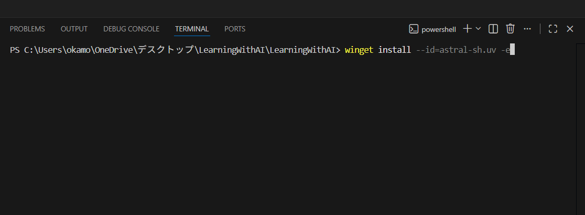

> 💡 途中で確認ダイアログが出た場合は、あわてずに「Y」や「はい」を選択してください。

---

## 7. nvm / Node.js / npx のインストール

### nvm・Node.js・npx とは？

- **nvm**：Node.js のバージョンを管理するツール
- **Node.js**：JavaScript を PC 上で動かすための実行環境
- **npx**：Node.js のプログラムを手軽に実行するツール（後述の Brave Search MCP で使います）

---

### 7-1. nvm をインストール

Terminal に以下のコマンドを貼り付けて実行します。

```
winget install -e --id CoreyButler.NVMforWindows
```

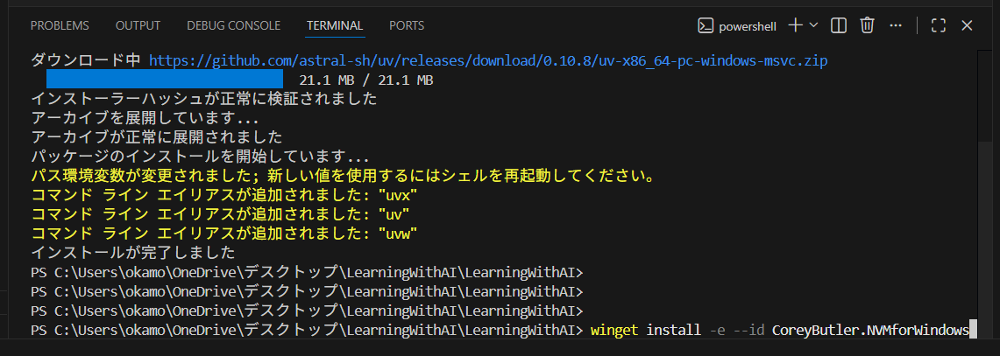

> ⚠️ **インストール後は PC を再起動してください。**  
> uv と nvm のパスを環境変数に反映させるために必要です。

---

### 7-2. Node.js をインストール

再起動後、VS Code を起動して Terminal を開き（`Ctrl` + `Shift` + `@`）、以下を実行します。

```
nvm install lts
```

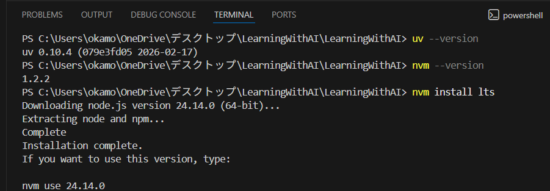

---

### 7-3. Node.js のバージョンを切り替え

以下のコマンドでインストールした Node.js を有効化します。

```
nvm use 24.14.0
```

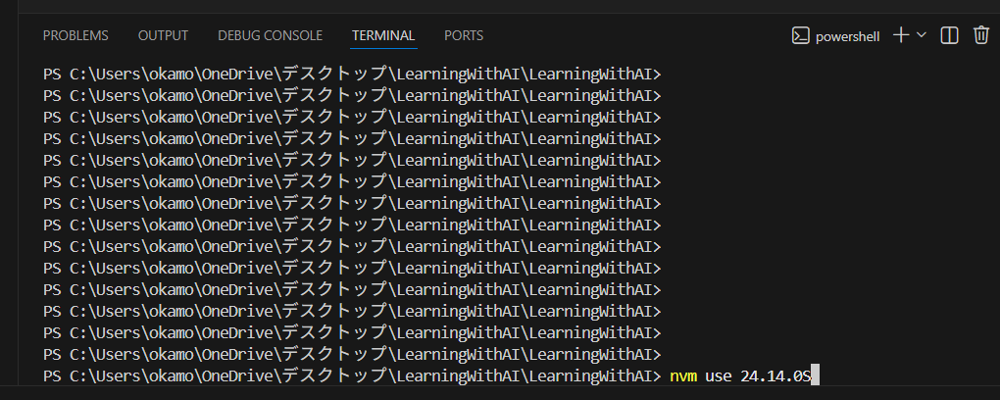

> 💡 バージョン番号は環境によって異なる場合があります。`nvm install lts` 完了後に表示されたバージョン番号を使ってください。

---

### 7-4. PowerShell の実行ポリシーと npx の確認

①以下のコマンドで PowerShell の実行権限を設定します。

```
Set-ExecutionPolicy -ExecutionPolicy RemoteSigned -Scope CurrentUser
```

②以下のコマンドで npx のバージョンを確認します（数字が表示されれば成功）。

```
npx --version
```

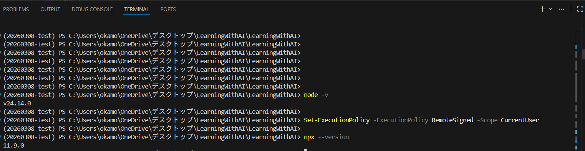

> 💡 実行ポリシーの変更は「スクリプトの実行を許可しますか？」という意味です。確認メッセージが出た場合、`Y` を押して承認してください。

---

## 8. Brave Search API の登録

### Brave Search とは？

**Brave Search API** を登録することで、AI が Web 上の画像や情報を検索できるようになります。

---

### 8-1. アカウント登録

👉 https://api-dashboard.search.brave.com/register からサインアップ（アカウント登録）します。

---

### 8-2. API キーをコピー

登録後、ダッシュボード（https://api-dashboard.search.brave.com/app/dashboard）にアクセスし、**「API Keys」から API キーをコピーしてメモ**しておきます。

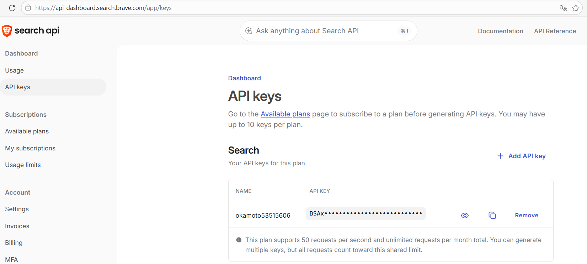

> 💡 **API キー** とは、サービスを利用するためのパスワードのようなものです。他の人には教えないようにしてください。

---

## 9. VOICEVOX のインストール

### VOICEVOX とは？

**VOICEVOX（ボイスボックス）** は、テキストを音声に変換するソフトです。これを入れることで、AI が「四国めたん」の声でしゃべれるようになります。

---

### 9-1. VOICEVOX をダウンロード

👉 https://voicevox.hiroshiba.jp/ にアクセスし、**右上のダウンロードボタン**を押します。

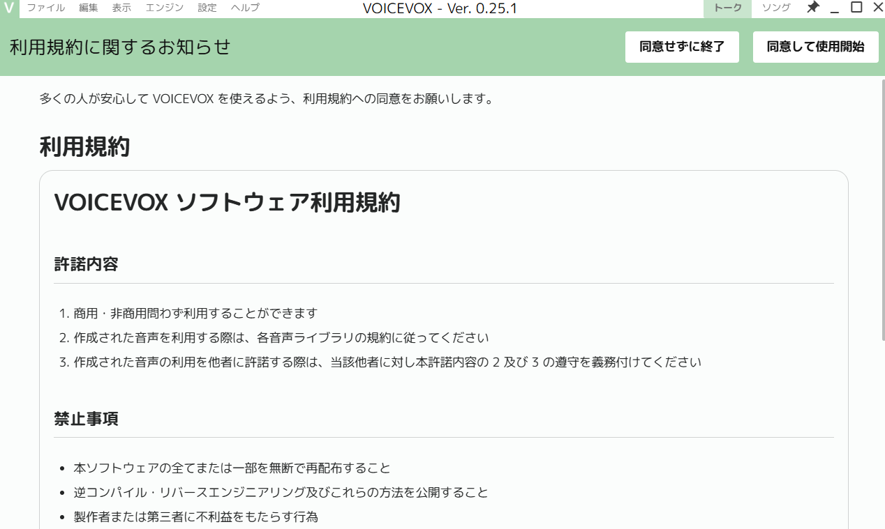

---

### 9-2. インストーラーを選択

OS や CPU の選択画面が出ます。**よくわからなければ「CPU」を選択**し、インストーラーを選択したまま **「ダウンロード」** ボタンを押してください。

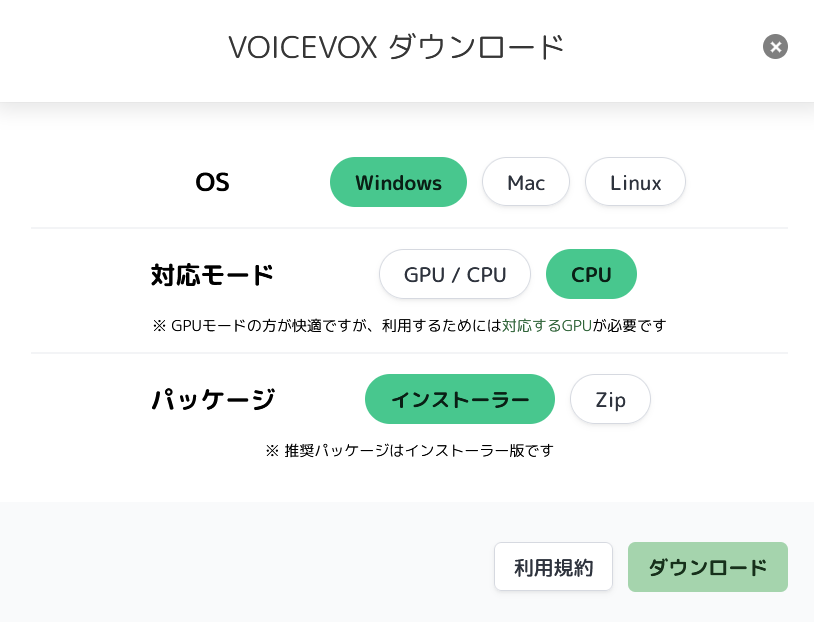

> 💡 ダウンロードにはしばらく時間がかかります。完了後、インストーラーをダブルクリックして起動し、画面の指示に従ってインストールしてください（すべて初期値のままで OK です）。

> 💡 VOICEVOX 起動後に規約確認画面が出たら、**「同意して使用開始」** ボタンを押してください。

---

## 10. MCP の設定

### MCP とは？

**MCP（Model Context Protocol）** は、AI とツール（Brave Search・VOICEVOX など）を繋げるための設定です。これを設定することで、AI が画像検索をしたり、声でしゃべったりできるようになります。

---

### 10-1. MCP の設定ファイルを開く

VS Code を開いた状態で **`Ctrl` + `Shift` + `P`** を押します。

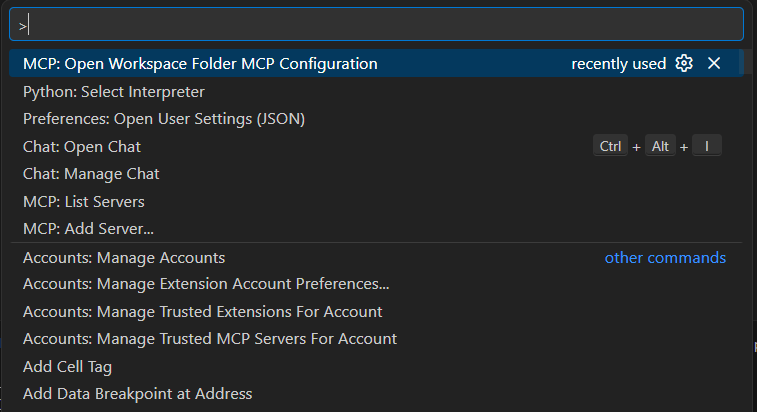

入力欄に `MCP` と入力し、**「MCP: Open...」** を選択します。

---

### 10-2. 設定ファイルを作成

**「Create File」** ボタンを押します。

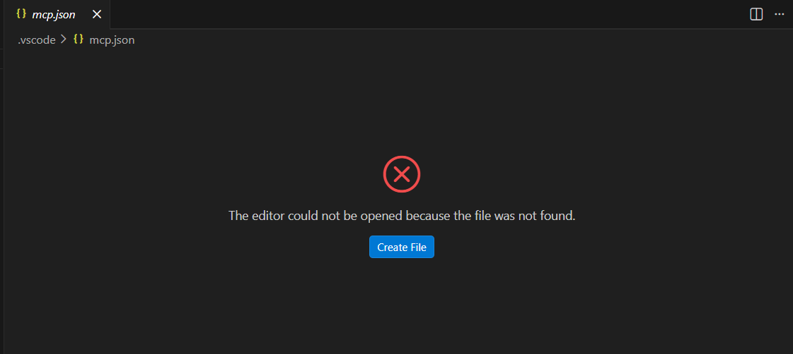

---

### 10-3. 設定内容を貼り付け

`mcp.json` に以下の内容を **すべて選択して上書き貼り付け**します。`ここにBraveのAPIキー` の部分は、先ほどメモした API キーに置き換えてください。

```json
{
  "servers": {
    "brave-search": {
      "command": "npx",
      "args": [
        "-y",
        "@brave/brave-search-mcp-server"
      ],
      "env": {
        "BRAVE_API_KEY": "ここにBraveのAPIキー"
      }
    },
    "voicevox": {
      "command": "uvx",
      "args": ["mcp-server-voicevox", "--voicevox-url=http://localhost:50021"]
    }
  }
}
```

---

### 10-4. MCP サーバーを起動

`mcp.json` の中に現れる **▷ Start ボタン**を押します（下の画像の赤枠内です）。

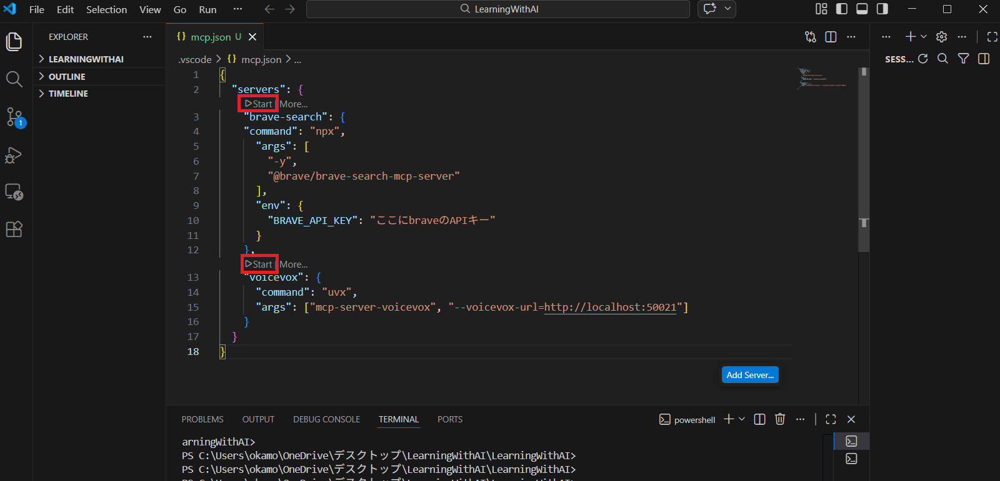

> 💡 すべての「Start」が「Running」に変われば成功です。

---

## 11. Claude のテスト

### 11-1. Claude Opus 4.6 を選択

右下のチャット欄にて、**Claude Opus 4.6** を選択します。

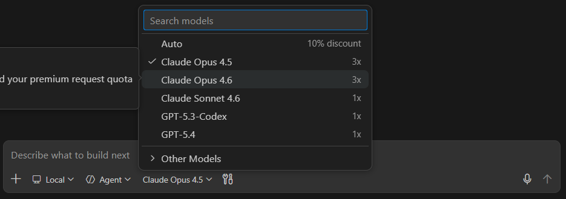

> 💡 **Claude Opus 4.6 とは？**  
> Anthropic 社が 2026 年 2 月に発表した最新の最上位 AI モデルです。最大 100 万トークンの長文処理、自動最適化される「適応的思考（Adaptive Thinking）」、エージェント連携機能を搭載し、複雑な推論・コーディング業務に特化した高い信頼性を持つのが特徴です。

---

### 11-2. テスト用プロンプトを実行

右下のチャット欄に以下をコピー＆貼り付けして、Enter キーを押します。

```
brave-searchのmcpよる画像検索→curl.exeによる画像DLと
voicevoxのmcpによる四国めたんの声でのテキスト読み上げについてテストしたいです。順番に。
mcpの使い方知ってます？うまくいかないようでしたら、マニュアルを探して提示します。
brave_image_search
    Get images from the web relevant to the query
    Inputs:
        query (string): The term to search the internet for images of
        count (number, optional): The number of images to return (max 50, default 10)
voicevoxのmcp
get_voices - VoiceVox から利用可能な音声のリストを取得
    引数は必要ありません
text_to_speech - VoiceVox を使用してテキストを音声に変換
    必須引数：
        text (文字列): 音声に変換するテキスト
    オプション引数：
        speaker_id (整数、デフォルト: 1): 使用する音声の ID
        speed (数値、デフォルト: 1.3): 再生速度の倍率
```

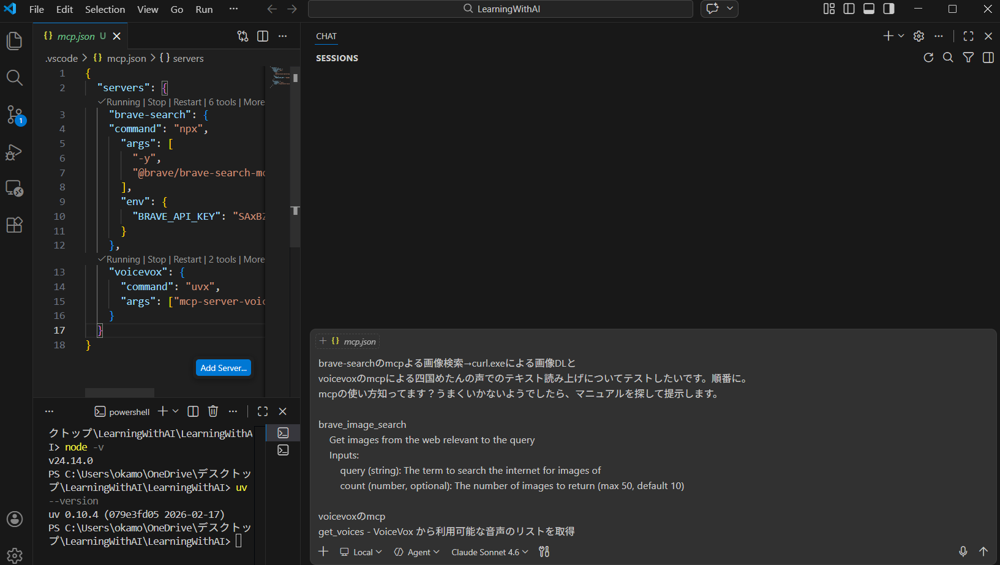

---

### 11-3. Python インストール確認ダイアログ

Python のインストール確認ダイアログが出ますが、Claude にすべてお任せするので **「Don't ask again」** をクリックします。

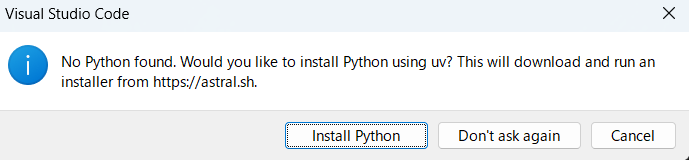

---

### 11-4. 許可ダイアログへの対応

確認ダイアログが出たら **「Always Allow（常に許可）」** を選択してください。

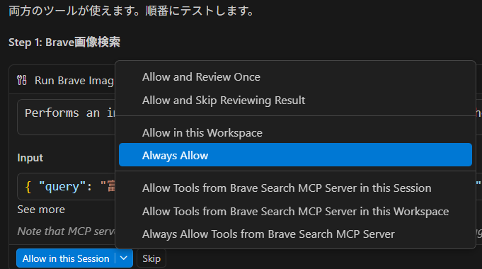

レビューの確認が出たら **「Always Allow Without Review（レビューなしで常に許可）」** を選択してください。

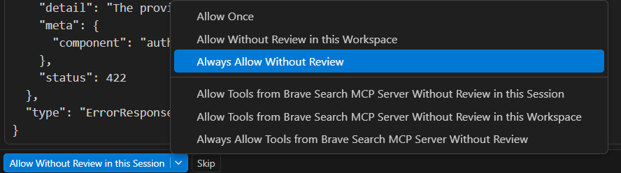

しばらく待ちます。以下のような成功メッセージが出れば完了です！

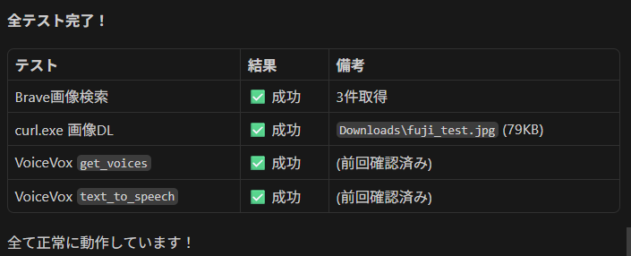

> 💡 **うまくいかないときは、そのままクロードに相談してみてください。**  
> エラーメッセージが出たら、英語でも日本語でもそのままコピーして「こんなエラーが出たんだけど、どうすればいい？」と貼り付けるだけで OK です。  
> クロードが原因を調べて、次にやることをわかりやすく教えてくれます。

---

## 12. 設定ファイルのダウンロード

ここで、**`copilot-instructions.md`**（AI にお子様向けの対応方法を知らせるためのファイル）をダウンロードします。

---

### 12-1. Terminal でコマンドを実行

VS Code を開いた状態で **`Ctrl` + `Shift` + `@`** を押して Terminal を開き、以下のコマンドを貼り付けて実行します。

```powershell
# zip でダウンロードして展開・上書き
curl.exe -L -o repo.zip https://github.com/okamoto53515606/LearningWithAI/archive/refs/heads/main.zip
Expand-Archive -Path repo.zip -DestinationPath _tmp -Force
Copy-Item -Path "_tmp\LearningWithAI-main\*" -Destination "." -Recurse -Force
Remove-Item _tmp, repo.zip -Recurse -Force
```

---

### 12-2. お子様の名前に書き換え

**`Ctrl` + `Shift` + `E`** の 3 キーを同時に押して、ファイルのエクスプローラーを開き、.githubフォルダにあるcopilot-instructions.mdをクリックして開きます。

**`Ctrl` + `H`** を押して一括置換 UI を開き、「たろうくん」をお子様の名前に書き換えてください。

> 💡 例：「たろうくん」→「はなこちゃん」など

---

### 12-3. PC を再起動

設定を反映させるために **PC を再起動**してください。

---

## 13. 音声入力のセットアップ

PC 再起動後、以下の手順で声で話しかけられるようにします。

---

### 13-1. VOICEVOX と VS Code を起動

再起動後、まず **VOICEVOX を起動**してから **VS Code を起動**してください。

> ⚠️ VOICEVOX が起動していないと、AI が声でしゃべれません。毎回 VS Code を使う前に VOICEVOX を先に起動する習慣をつけましょう。

---

### 13-2. MCP サーバーを再起動

VS Code を開いた状態で **`Ctrl` + `Shift` + `P`** を押し、「MCP: Open...」を選択します。  
`mcp.json` の **▷ Start ボタン**を押して、すべてが「Running」になるまで待ちます。


---

### 13-3. VS Code Speech をインストール

**`Ctrl` + `Shift` + `X`** を押して拡張機能画面を開き、検索欄に **`VS Code Speech`** と入力してインストールします（既にインストール済みの場合は何もしなくて OK）。

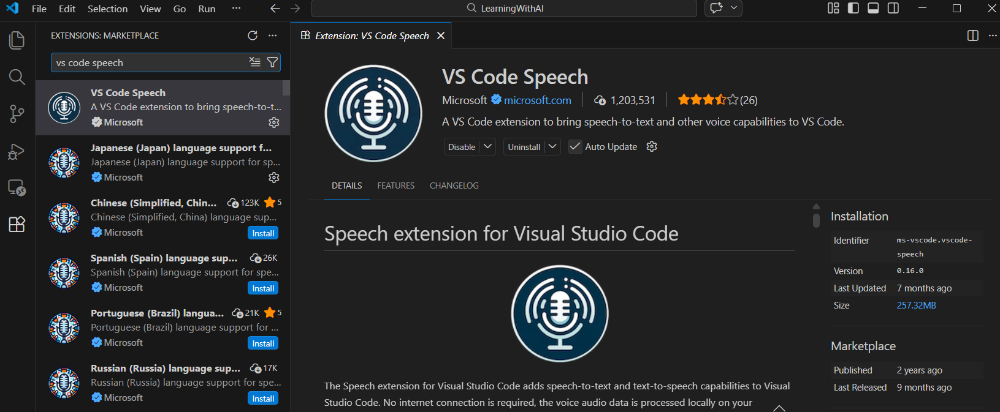

---

### 13-4. 日本語音声サポートをインストール

同様に、**`Japanese Language Support for VS Code Speech`** と検索してインストールします（既にインストール済みの場合は何もしなくて OK）。

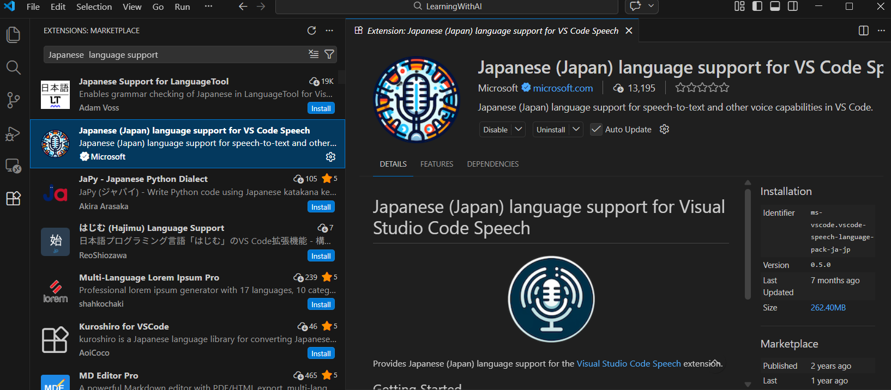

---

### 13-5. 音声言語を設定

**`Ctrl` + `,`** を押して設定画面を開き、検索欄に **`accessibility.voice.speechLanguage`** と入力して、**「Japanese (Japan)」** を選択します。

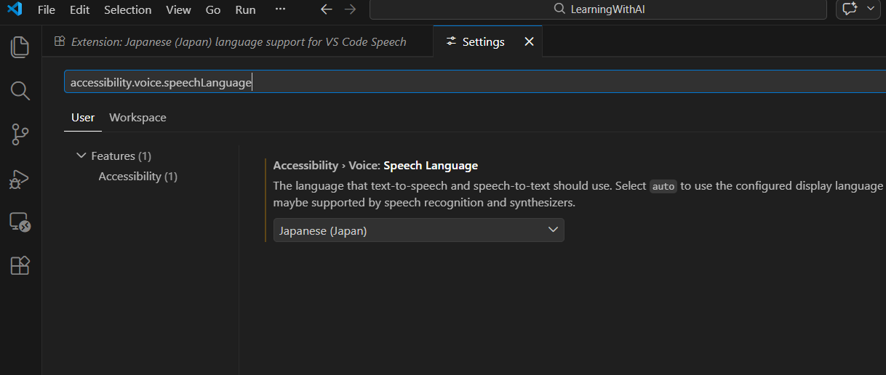

---

### 13-6. マイクで話しかけてみよう

右下のチャット欄にある **マイクマーク** をクリックします。

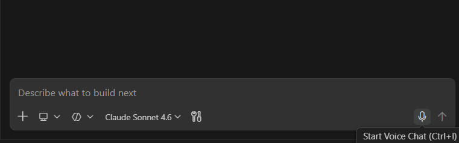

「こんにちは」と声をかけ、自動入力されることを確認してから Enter キーを押します。

---

### 13-7. セットアップ完了！

くろーどちゃんからの応答（声付き）があれば、セットアップ完了です！🎉

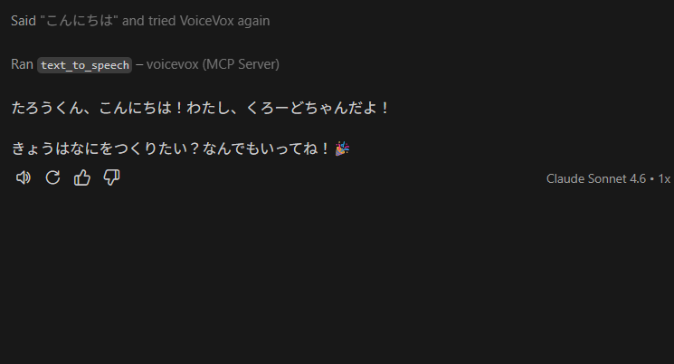

---

## お疲れさまでした！

これでセットアップはすべて完了です。  
お子様と一緒に、くろーどちゃんと楽しいプログラミングライフを始めましょう！

> 💡 **次回 VS Code を使うときの起動手順：**  
> ① VOICEVOX を起動  
> ② VS Code を起動  
> ③ MCP の ▷ Start ボタンを押して「Running」にする  
> これだけです！

---

*このガイドは `docs/claude-chan-setup-guide.md` に保存されています。*
